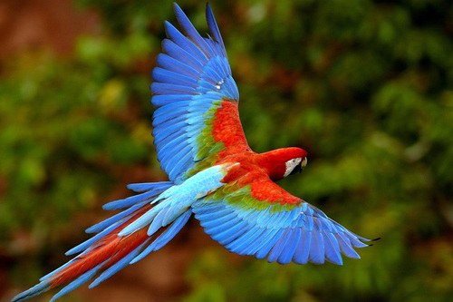
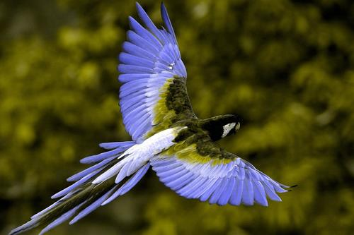
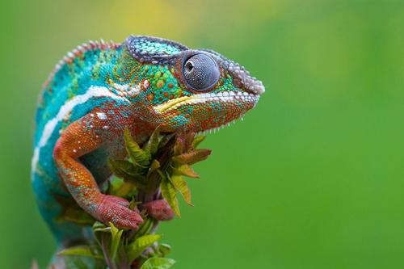
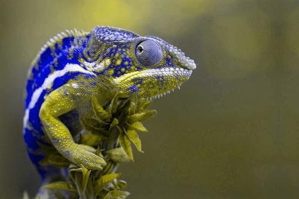
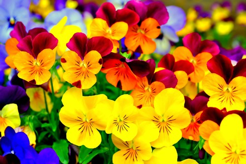

Colour Blindness Simulator
==============

This is a simple Matlab script that calculates the transformation matrix for selected colour blindness disorder and uses it to create the simulation best on the input image. 


# Sources of inspiration

This script is created based on the concepts and calculations presented in **[Color Blindness Simulation Research.](http://ixora.io/projects/colorblindness/color-blindness-simulation-research/)**

# How to Run

To Run the script you will need any MATLAB version which can run functions like imread and imshow.
To use the script open the Matlab and specify the path to the folder containing the script.
Now you can either run the Example.m script or run the following code in the Matlab Comand Window:

```
img = imread('img/img1.jpg');
newImg = coltrans(img, 'Protanopia');
```

# Examples 

Example images transformed with this script:

| Img Input | Result|
|:-:|:-:|
|  |  |
| [Image link](http://moziru.com/explore/Red-and-green%20Macaw%20clipart%20rainforest%20bird/#go_post_3740_macaw-clipart-colorful-bird-1.jpg)| Protanopia |
|  | |
| [Image link](http://picanimal.com/lizard-rainbow-colored-hd-photo-reptile/lizard-colored-rainbow-image-reptile/)| Deuteranopia |
|  | |
| [Image link](https://www.tapetus.pl/223859,kwiaty-bratki.php)| Tritanomaly |
